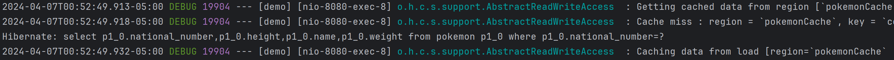

# Principios de Diseño - Programación Estructurada

## Instrucciones

Implementar una aplicación en SpringBoot, con JPA y conexión a base de datos H2.

La aplicación debe escribir registros en la base de datos y también acceder para leer los registros. Al leer se debe almacenar en caché. A partir de ahí los datos de ese registro los devolverá desde el caché, sin necesidad de acceder a la base.

Presentar en una diapositiva: Caché en memoria y Redis.


## Integrantes

- David Guamán
- Mateo Jaramillo
- David Naverrete
- Christian Jácome

## Recursos

- [Spring Boot](https://start.spring.io/)
- [Docker](https://www.docker.com/products/docker-desktop/)
- [Imagen de redis en Docker](https://hub.docker.com/_/redis)

## Spring Boot

### Módulos necesarios

- Spring Web
- Thymeleaf
- Spring Boot DevTools
- Spring Data JPA
- Lombok
- H2 Database

> [!Note]
> Los módulos ya se encuemtran instalados en el proyecto.


## Redis

### Instalación de redis:

``` cli
> docker pull redis
> docker docker run --name redisDemo -p 6379:6379 -d redis
```

### Terminal:

```cli
> docker exec -it redisDemo redis-cli
```

### Comandos:

``` cli
> PING
> KEYS *
> FLUSHALL
```

# Resultados

## Página web

Se accede al *endpoint* `http://localhost:8080/pokemon?id=1`


## Primera lectura

En la primera lectura, la caché "falla" en encontrar la información del pokemon con id = 1, por lo que accede a la base de datos. Esto se lo puede apreciar en la línea de *Hibernate*. Al final el dato se guarda en la caché.



``` cli
> Getting cached data from region [`pokemonCache` (AccessType[read-write])] by key [com.pokemon.demo.model.Pokemon#1]
> Cache miss : region = `pokemonCache`, key = `com.pokemon.demo.model.Pokemon#1`
> Hibernate: select p1_0.national_number,p1_0.height,p1_0.name,p1_0.weight from pokemon p1_0 where p1_0.national_number=?
> Caching data from load [region=`pokemonCache` (AccessType[read-write])] : key[com.pokemon.demo.model.Pokemon#1] -> value[CacheEntry(com.pokemon.demo.model.Pokemon)]
```

## Segunda lectura

En la segunda lectura, la caché ya cuenta con la información de pokemon con id = 1, por ende, ya no es necesario acceder a la base de datos. Esto se lo puede evidenciar en la última línea.


```cli
> Getting cached data from region [`pokemonCache` (AccessType[read-write])] by key [com.pokemon.demo.model.Pokemon#1]
> Checking readability of read-write cache item [timestamp=`7014273719951360`, version=`null`] : txTimestamp=`7014274480545792`
> Cache hit : region = `pokemonCache`, key = `com.pokemon.demo.model.Pokemon#1`
```

## Referencias

- [Scaling Spring Boot with Hibernate 2nd Level Cache on Redis](https://medium.com/@shahto/scaling-spring-boot-with-hibernate-2nd-level-cache-on-redis-54d588fc8b06 )
- [Serving Web Content with Spring MVC](https://spring.io/guides/gs/serving-web-content)
